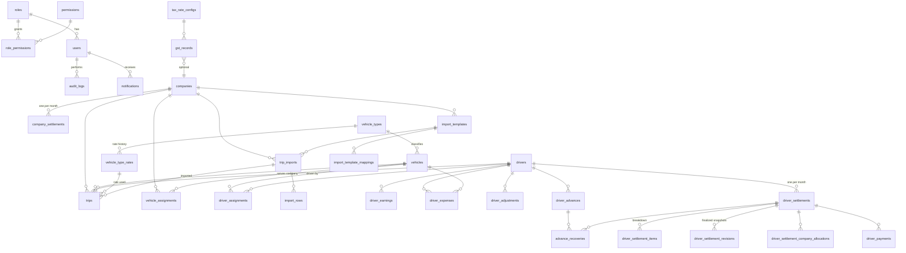

# LV Transport Billing System — Entity Relationship Design

This is the target data model for V1. Tables are **migrated phase by phase**; the
"Phase" column shows when each table is introduced. Conventions are in
[ARCHITECTURE.md](ARCHITECTURE.md#data-conventions).

Global conventions for every table:

- `id INT AUTO_INCREMENT` primary key (JSON-safe; `BigInt` avoided on purpose).
- `created_at`, `updated_at` (UTC `DATETIME(3)`); `created_by_id` → `users.id` on all business records.
- Money is `DECIMAL(15,2)`. KM is `DECIMAL(12,2)`. Rate per km is `DECIMAL(10,2)`.
- Settlement months are `CHAR(7)` `YYYY-MM`. Business dates are `DATE` (Asia/Kolkata calendar date).
- Financial records are never hard-deleted: they are voided/reversed with a reason.

## Relationship overview

## Tables

### Identity & access (Phase 2)

| Table              | Key columns                                                           | Notes                                                                                             |
| ------------------ | --------------------------------------------------------------------- | ------------------------------------------------------------------------------------------------- |
| `roles`            | `code` UNIQUE (`ADMIN`, `BILLER`, `AUDITOR`), `name`                  | Exactly three roles, seeded. Not user-creatable.                                                  |
| `permissions`      | `code` UNIQUE (e.g. `settlement.finalize`)                            | Seeded; backend checks permissions, not role names.                                               |
| `role_permissions` | PK(`role_id`,`permission_id`)                                         | Seeded matrix from spec §7–9. "Roles" screen is read-only in V1.                                  |
| `users`            | `email` UNIQUE, `password_hash`, `role_id`, `status`, `last_login_at` | One role per user, so no `user_roles` table. Role changes are audited (role history = audit log). |

### Master data (Phase 3)

| Table                 | Key columns                                                                                                                                                         | Notes                                                                                      |
| --------------------- | ------------------------------------------------------------------------------------------------------------------------------------------------------------------- | ------------------------------------------------------------------------------------------ |
| `companies`           | `code` UNIQUE, `name` UNIQUE, contact fields, `gstin`, `status`                                                                                                     | Name unique to prevent accidental duplicates; code is the short import/report key.         |
| `drivers`             | `driver_code` UNIQUE, `full_name`, `phone` UNIQUE, `license_number` UNIQUE NULL, `license_expiry`, bank/UPI fields, `status`                                        | Bank account stored as entered; masked in list APIs.                                       |
| `vehicle_types`       | `name` UNIQUE, `description`, `status`                                                                                                                              | e.g. Sedan, SUV, Innova.                                                                   |
| `vehicle_type_rates`  | `vehicle_type_id`, `rate_per_km`, `effective_from`, `effective_to` NULL, `status`                                                                                   | See _Rate history rules_ below. INDEX(`vehicle_type_id`,`effective_from`).                 |
| `vehicles`            | `registration_number` UNIQUE (normalized upper-case, no spaces), `vehicle_type_id`, make/model/year/fuel, insurance/fitness/permit numbers + expiry dates, `status` | "Assigned driver/company" are derived from current assignments, not stored.                |
| `vehicle_assignments` | `vehicle_id`, `company_id`, `start_date`, `end_date` NULL                                                                                                           | Which company a vehicle serves, over time. No overlaps per vehicle (service-enforced).     |
| `driver_assignments`  | `driver_id`, `vehicle_id`, `start_date`, `end_date` NULL                                                                                                            | Which vehicle a driver drives, over time. No overlaps per driver or per vehicle.           |
| `settings`            | `key` PK, `value` JSON                                                                                                                                              | Configurable rules (duplicate keys, allocation method, tax defaults). Exists from Phase 1. |

A company's drivers = drivers whose driver-assignment overlaps a vehicle-assignment of
that company. Trips always store company, driver and vehicle directly, so reporting
never depends on reconstructing assignments.

### Company settlement (Phase 4)

| Table                 | Key columns                                                                                                                                                                  | Notes                                                                              |
| --------------------- | ---------------------------------------------------------------------------------------------------------------------------------------------------------------------------- | ---------------------------------------------------------------------------------- |
| `company_settlements` | `company_id`, `settlement_month`, `expected_amount`, `received_amount` NULL, `status` (`PENDING`/`RECEIVED`), `received_date`, `payment_method`, `reference_number`, `notes` | **UNIQUE(`company_id`,`settlement_month`)**. Both expected and received preserved. |

### Trips & import (Phases 5–6)

| Table                      | Key columns                                                                                                                                                                                                                                                                                                                                                                                | Notes                                                                                                                                                                          |
| -------------------------- | ------------------------------------------------------------------------------------------------------------------------------------------------------------------------------------------------------------------------------------------------------------------------------------------------------------------------------------------------------------------------------------------ | ------------------------------------------------------------------------------------------------------------------------------------------------------------------------------ |
| `trips`                    | `company_id`, `driver_id`, `vehicle_id`, `vehicle_type_id` (snapshot), `trip_date`, `settlement_month` (derived from trip date), `external_trip_id`, `trip_reference`, `pickup`, `drop_location`, `start_km`, `end_km`, `total_km`, `km_source` (`START_END`/`DIRECT`), `rate_id`, `rate_per_km` (snapshot), `earnings`, `source` (`MANUAL`/`IMPORT`), `import_id`, `status`, `extra` JSON | **UNIQUE(`company_id`,`external_trip_id`)** (NULLs allowed). Indexes on company, driver, vehicle, trip_date, settlement_month, status. `extra` holds company-specific columns. |
| `import_templates`         | `company_id`, `name`, `date_format`, `km_mode`, `duplicate_key` JSON, `status`                                                                                                                                                                                                                                                                                                             | UNIQUE(`company_id`,`name`).                                                                                                                                                   |
| `import_template_mappings` | `template_id`, `source_column`, `target_field`, `transform` NULL                                                                                                                                                                                                                                                                                                                           | Reusable column mapping.                                                                                                                                                       |
| `trip_imports`             | `company_id`, `template_id`, `file_name`, `document_id`, counts (total/valid/warning/error/duplicate/imported), `status`, `error_summary`                                                                                                                                                                                                                                                  | Import batch history.                                                                                                                                                          |
| `import_rows`              | `import_id`, `row_number`, `raw` JSON, `normalized` JSON, `status` (`VALID`/`WARNING`/`ERROR`/`DUPLICATE`), `messages` JSON, `trip_id` NULL                                                                                                                                                                                                                                                | Drives preview and the downloadable error report.                                                                                                                              |

### Driver financial transactions (Phases 7–8)

All carry `driver_id`, `settlement_month`, `amount`, `created_by_id`, `status`
(`ACTIVE`/`VOID`), and `driver_settlement_id` NULL, which is set when a settlement
locks them. Locked rows cannot be edited or voided.

| Table                | Key columns                                                                                                                                              | Notes                                                                                                                                                                                                                                                        |
| -------------------- | -------------------------------------------------------------------------------------------------------------------------------------------------------- | ------------------------------------------------------------------------------------------------------------------------------------------------------------------------------------------------------------------------------------------------------------ |
| `driver_earnings`    | `type` (`ALLOWANCE`/`OTHER_EARNING`), `earning_date`, `description`                                                                                      | Separate line items, never merged.                                                                                                                                                                                                                           |
| `driver_adjustments` | `type` (`POSITIVE_ADJUSTMENT`/`OTHER_DEDUCTION`), `reason` NOT NULL, `adjustment_date`                                                                   | Mandatory reason means no unexplained deductions.                                                                                                                                                                                                            |
| `driver_expenses`    | `paid_by` (`LV`/`DRIVER`), `category` (`FUEL`/`TOLL`/`MAINTENANCE`/`EMI`/`OTHER`), `vehicle_id` NULL, `expense_date`, `description`                      | LV-paid → deduction; driver-paid → reimbursement. Allowed categories: LV = FUEL/TOLL/MAINTENANCE/EMI; DRIVER = FUEL/TOLL/MAINTENANCE/OTHER. The "LV Expenses" screen is this table filtered by `paid_by = LV`, so no separate `lv_expenses` table is needed. |
| `driver_advances`    | `amount`, `advance_date`, `reason`, `payment_method`, `reference_number`, `recovered_amount`, `outstanding_amount`, `status` (`OPEN`/`RECOVERED`/`VOID`) | Recovered and outstanding amounts are maintained transactionally with a row lock.                                                                                                                                                                            |
| `advance_recoveries` | `advance_id`, `driver_settlement_id` NULL, `settlement_month`, `amount`                                                                                  | Partial recovery; sum ≤ advance amount (service-enforced under a lock).                                                                                                                                                                                      |

### Driver settlement & payments (Phases 9–10)

| Table                                   | Key columns                                                                                                                                                                                                                                                                                                                                                                                                                                           | Notes                                                                                                           |
| --------------------------------------- | ----------------------------------------------------------------------------------------------------------------------------------------------------------------------------------------------------------------------------------------------------------------------------------------------------------------------------------------------------------------------------------------------------------------------------------------------------- | --------------------------------------------------------------------------------------------------------------- |
| `driver_settlements`                    | `driver_id`, `settlement_month`, `status` (`DRAFT`→`CALCULATED`→`UNDER_REVIEW`→`APPROVED`→`FINALIZED`), `payment_status` (`UNPAID`/`PARTIALLY_PAID`/`PAID`), component totals (`trip_earnings`, `allowances`, `other_earnings`, `positive_adjustments`, `reimbursements`, `fuel`, `toll`, `maintenance`, `emi`, `advance_recovery`, `other_deductions`), `gross_earnings`, `final_amount`, `paid_amount`, `version`, workflow actor/timestamp columns | **UNIQUE(`driver_id`,`settlement_month`)**.                                                                     |
| `driver_settlement_items`               | `driver_settlement_id`, `component`, `source_type`, `source_id`, `description`, `amount`                                                                                                                                                                                                                                                                                                                                                              | Line-level breakdown for the transparent calculation view.                                                      |
| `driver_settlement_revisions`           | `driver_settlement_id`, `version`, `snapshot` JSON, `reason`, `reopened_by_id`                                                                                                                                                                                                                                                                                                                                                                        | Full finalized state preserved before every reopen.                                                             |
| `driver_settlement_company_allocations` | `driver_settlement_id`, `company_id`, `amount`                                                                                                                                                                                                                                                                                                                                                                                                        | Splits a finalized settlement across companies for company-wise profit. **Open question**, see ARCHITECTURE.md. |
| `driver_payments`                       | `driver_settlement_id`, `driver_id`, `amount`, `payment_date`, `payment_method`, `reference_number`, `notes`, `status` (`VALID`/`REVERSED`), `reversal_reason`                                                                                                                                                                                                                                                                                        | Immutable once recorded; corrected only by reversal.                                                            |

### Tax, documents, notifications, audit (Phases 14–16)

| Table              | Key columns                                                                                                                                                                                                                            | Notes                                                                                                     |
| ------------------ | -------------------------------------------------------------------------------------------------------------------------------------------------------------------------------------------------------------------------------------- | --------------------------------------------------------------------------------------------------------- |
| `tax_rate_configs` | `hsn_sac`, `description`, `rate`, `cess_rate`, `effective_from`, `effective_to`                                                                                                                                                        | Rates never hard-coded.                                                                                   |
| `gst_records`      | `direction` (`OUTWARD`/`INWARD`), `company_id` NULL, `counterparty_gstin`, `invoice_number`, `invoice_date`, `tax_period`, `hsn_sac`, `taxable_value`, `tax_rate`, `cgst`, `sgst`, `igst`, `cess`, `place_of_supply`, `reverse_charge` | UNIQUE(`direction`,`counterparty_gstin`,`invoice_number`). Reporting/preparation only.                    |
| `documents`        | `entity_type`, `entity_id`, `category`, `file_name`, `mime_type`, `size_bytes`, `storage_key`, `checksum`, `uploaded_by_id`, `deleted_at`                                                                                              | Polymorphic link. Served only through an authorized download endpoint; never public URLs.                 |
| `notifications`    | `user_id`, `type`, `title`, `message`, `entity_type`, `entity_id`, `read_at`                                                                                                                                                           | In-app. A future `notification_deliveries` table adds email/SMS/WhatsApp channels.                        |
| `audit_logs`       | `user_id`, `action`, `entity_type`, `entity_id`, `previous_value` JSON, `new_value` JSON, `reason`, `ip`, `user_agent`, `request_id`, `created_at`                                                                                     | Append-only: no update/delete API. In production the DB user is granted INSERT/SELECT only on this table. |

## Rate history rules

1. Rates are never updated in place once any trip references them.
2. A new rate for a vehicle type must not overlap an existing active rate. MySQL has
   no exclusion constraints, so this is enforced in the rate service inside a
   transaction that locks the parent `vehicle_types` row (`SELECT … FOR UPDATE`).
3. Adding a rate after an open-ended rate (`effective_to IS NULL`) closes the
   previous rate at `new.effective_from - 1 day`. This is audited.
4. Trip rate lookup: `effective_from <= trip_date AND (effective_to IS NULL OR effective_to >= trip_date) AND status = ACTIVE`.
   Zero matches means a validation error ("No rate for Sedan on 2026-09-14"). More than
   one match cannot happen because of rule 2.

## Constraints summary (spec §58)

| Rule                                  | Enforcement                                |
| ------------------------------------- | ------------------------------------------ |
| Company + settlement month unique     | DB UNIQUE                                  |
| Driver + settlement month unique      | DB UNIQUE                                  |
| Vehicle registration unique           | DB UNIQUE on normalized value              |
| Company name and code unique          | DB UNIQUE                                  |
| External trip ID unique per company   | DB UNIQUE(`company_id`,`external_trip_id`) |
| No overlapping rates per vehicle type | Service + row lock                         |
| No overlapping assignments            | Service + row lock                         |
| Advance recovery ≤ outstanding        | Service + row lock                         |
| Payment ≤ settlement outstanding      | Service + row lock                         |
